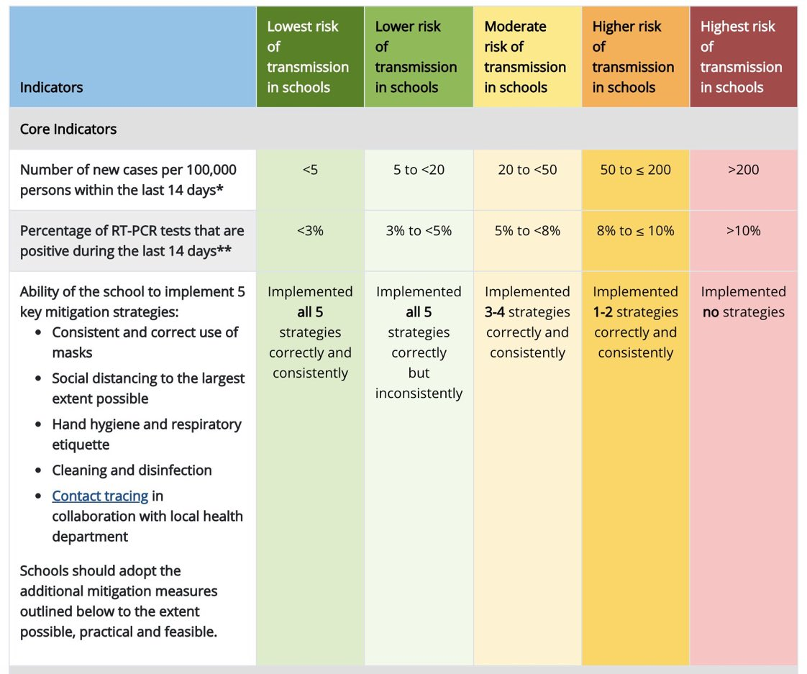

<font color="red"> Actualización: 07-11-2020 </font>.[^1] COVID-19 en el Área Sanitaria de Santiago. Semáforo para Centros Educativos.

Sin datos desagregados por Concello porque el SERGAS sigue sin publicarlos. 

[^1]: Esta página se actualiza diariamente

```{r echo=FALSE, message=F, warning=F}
fechaactual <-   "2020-11-07" #para las etiquetas 
fechasemaforo <- "2020-11-07"
fechacentro <-   "2020-11-07"
fechamapa <-     "2020-11-07"
```

```{=html}
<!-- ================= Caja 4 Casos nuevos detectados por PCR ================================== -->

  <div id="div4" class="div4" value="0"
        style = "padding-left: 10px;
                 background-color: gray30;
                 width: 400px">

    <p style = "font-weight: bold; font-size: 18px">Casos nuevos detectados: </p>

    <pre class="contador4"
          style="background-color: gray35; color: brown; font-weight: bold; padding-left: 50px; font-size: 50px" >
          0
    </pre>

  </div>

<!-- ================= Caja 3 Tasa 14 DÍAS ================================== -->

  <div id="div3" class="div3" value="0"
        style = "padding-left: 10px;
                 background-color: gray30;
                 width: 400px">

    <p style = "font-weight: bold; font-size: 18px">Tasa Positividad. Media móvil 14 días: </p>

    <pre class="contador3"
          style="background-color: gray35; color: brown; font-weight: bold; padding-left: 50px; font-size: 50px" >
          0
    </pre>

  </div>

  
<!-- ================= Caja 1 Activos hoy ================================== -->
  <div id="div1" class="div" value="0" 
        style = "padding-left: 10px; 
                background-color: gray30;
                width: 400px">
  
    <p style = "font-weight: bold; font-size: 18px">Nuevos casos activos hoy:</p>
    
    <pre class="contador" 
          style="background-color: gray35; 
                 color: brown; font-weight: bold; 
                 padding-left: 50px; 
                 font-size: 50px; padding-right: 10px" >
          0
    </pre>
    
  </div>

<!-- ================= Caja 2 Activos total ================================== -->

  <div id="div2" class="div2" value="0" 
        style = "padding-left: 10px; 
                 background-color: gray30;
                 width: 400px">
  
    <p style = "font-weight: bold; font-size: 18px">Casos activos hoy: </p>
    
    <pre class="contador2" 
          style="background-color: gray35; color: brown; font-weight: bold; padding-left: 50px; font-size: 50px" >
          0
    </pre>
    
  </div>
  
  
  
```


```{r echo = F}
htmltools::tags$script(src="./anime.min.js")
```

```{js echo = F}
<!-- ============== Caja 1 activos nuevos hoy ===========  -->
<!-- Caja div -->
anime({
            targets: "#div1",
            translateX: 250,
            direction: "alternate",
            rotate: "1turn",
            easing: "easeInOutExpo"
        });

var roundLogEl = document.querySelector(".contador");

        anime({
            targets: roundLogEl,
            innerHTML: [0, -48],
            easing: 'linear',
            round: 10, // Will round the animated value to 1 decimal
            duration: 4000
        });

<!-- ============== Caja 2 Activos total ===========  -->

anime({
            targets: "#div2",
            translateX: 250,
            rotate: "2turn",
            direction: "alternate",
            easing: "easeInOutSine"
        });

var roundLogEl2 = document.querySelector(".contador2");

        anime({
            targets: roundLogEl2,
            innerHTML: [0, 1289],
            easing: 'linear',
            round: 10, // Will round the animated value to 1 decimal
            duration: 4000
        });

<!-- ============== Caja 3 positividad 14 días ===========  -->

anime({
            targets: "#div3",
            translateX: 250,
            rotate: "2turn",
            direction: "alternate",
            easing: "easeInOutSine"
        });

var roundLogEl3 = document.querySelector(".contador3");

        anime({
            targets: roundLogEl3,
            innerHTML: [0, 6.21],
            easing: 'linear',
            round: 100, // Will round the animated value to 1 decimal
            duration: 4000
        });
        
<!-- ============== Caja 4 Casos nuevos detectados ===========  -->

anime({
            targets: "#div3",
            translateX: 250,
            rotate: "2turn",
            direction: "alternate",
            easing: "easeInOutSine"
        });

var roundLogEl3 = document.querySelector(".contador4");

        anime({
            targets: roundLogEl3,
            innerHTML: [0, 80],
            easing: 'linear',
            round: 100, // Will round the animated value to 1 decimal
            duration: 4000
        });

```

```{r echo=FALSE, message=F, warning=F}
#Cargar datos y librerías
library(dygraphs)
library(tidyverse)
library(ggiraph)
library(sf)
library(lubridate)

datos <- read.csv("C:/Users/Kifirifis/Desktop/Mi blog/Santiago-Covid/data-actualizada.csv", header = T)
datos$fecha <- as_date(datos$fecha)
datos <- datos %>% filter(fecha >= as.Date("2020-08-12"))

```

# Semáforo para la apertura de Centros Educativos

`A 07-11-2020 en el Área Sanitaria de Santiago se detectaron 80 nuevos casos y se dieron de alta a 128 lo que da lugar a 48 casos activo menos respecto al día 06-11-2020.`

`- La tasa "Positividad (Media móvil 14 días)" NO es óptima.`

`- La tasa "Número de casos por cada cien mil habitantes en los últimos 14 días" NO es óptima y está en la categoría de "Riesgo muy alto".`

`- Los ratios de los colegios no han bajado y el distanciamiento NO es óptimo.`

Para la selección de indicadores se utilizó la guía del [*Centers for Disease Control and Prevention*](https://www.cdc.gov/coronavirus/2019-ncov/community/schools-childcare/indicators.html#interpretation)



## Indicador 1
<!-- TODO Poner vline toque de queda -->
```{r, message=F, warning=F, echo=F}
datos2 <- read.csv("C:/Users/Kifirifis/Desktop/Mi blog/Santiago-Covid/datapositividad.csv", header = T)
datos2$fecha <- as_date(datos2$fecha)

source("C:/Users/Kifirifis/Desktop/Mi blog/Santiago-Covid/funsemaforo2.R")
source("C:/Users/Kifirifis/Desktop/Mi blog/Santiago-Covid/funsemaforo.R")

datos2 <- datos2 %>% filter(fecha > as_date("2020-08-15")) %>% mutate(catorce = round(catorce, 2))

ggplot() +
    
        #Semáforo
        semaforo2() +
  
        #Puntos positividad
        geom_point_interactive(
                data = datos2,
                aes(fecha, posit, tooltip = posit),
                alpha = 0.1,
                col = "black",
                size = 3
        ) +
        
        # MA14
        geom_line(
                data = datos2,
                aes(fecha,  posiMA14, col = "black"),
                # size = 1.5
                alpha = 0.8
        ) +
  
        geom_point_interactive(
          data = datos2,
          aes(fecha, posiMA14, tooltip = posiMA14)
        ) + 
        
        #5%
        geom_hline(yintercept = 5, linetype = 2, col = 2) +
        
        # Etiquetas
        
        labs(x = "", y = "", title = "Proporción PCR+ Media móvil 14 días (Positividad)",
             caption = "Elaboración: @JKniffki | KStats®", 
             subtitle =  paste("Actualización:", fechasemaforo)) + 
        
        theme(
              legend.title = element_blank(),
              panel.grid.major.x = element_blank(),
              panel.grid.minor.x = element_blank(),
              panel.border = element_blank()) +
        
        geom_vline(xintercept = as_date("2020-09-10"), linetype = 2, alpha = 0.7) +
        geom_vline(xintercept = as_date("2020-09-21"), linetype = 2, alpha = 0.7) +
        
        annotate("text", x = as_date("2020-09-03"), y = 1, label = "Vuelta al Cole", size = 2.5) + 
        annotate("text", x = as_date("2020-09-16"), y = 1, label = "Vuelta USC", size = 2.4) + 
        
        
        # Escalas 
        scale_alpha_identity(guide = "none") +
        scale_color_identity(guide = "legend",
                             labels = "Media móvil 14 días") +
        
        scale_y_continuous(labels = function(x) paste0(x, "%"), expand = c(0, 0.1)) +
        
        scale_x_date(date_minor_breaks = "week", date_breaks = "week", date_labels = "%b %d") +
        theme(axis.text.x = element_text(angle = 60, hjust = 1)) + #ángulo de la etiqueta
  
        expand_limits(x = as_date("2020-10-30")) -> gg4

girafe(code = print(gg4))

```

## Indicador 2

```{r echo=F, warning=F, message=F}
ggplot() +
        
        semaforo() +
        
        geom_point_interactive(data = datos2, aes(fecha, catorce, tooltip = catorce), size = 1.5) +
        
        geom_line(data = datos2, aes(fecha, catorce), 
                  # size = 1.5,
                  alpha = 0.8) +
        
        # Etiquetas        
        theme(
              legend.title = element_blank(),
              panel.grid.major.x = element_blank(),
              panel.grid.minor.x = element_blank(),
              panel.border = element_blank()) +
        
        labs(x = "", y = "", 
             title = "Nº casos notificados por cada 100 Mil habitantes últimos 14 días",
             subtitle =  paste("Actualización:", fechasemaforo),
             caption = "Elaboración: @JKniffki | KStats®") +
        
        geom_vline(xintercept = as_date("2020-09-10"), linetype = 2, alpha = 0.7) +
        geom_vline(xintercept = as_date("2020-09-21"), linetype = 2, alpha = 0.7) +
        
        annotate("text", x = as_date("2020-09-03"), y = 25, label = "Vuelta al Cole", size = 2.5) + 
        annotate("text", x = as_date("2020-09-16"), y = 25, label = "Vuelta USC", size = 2.5) + 
        
        # Escalas
        
        scale_alpha_identity(guide = "none") +
        scale_y_continuous(expand = c(0, 0), limits = c(0, 320)) +
  
        scale_x_date(date_minor_breaks = "week", date_breaks = "week", date_labels = "%b %d") +
        theme(axis.text.x = element_text(angle = 60, hjust = 1)) + #ángulo de la etiqueta
        
        expand_limits(x = as_date("2020-10-30")) -> gg9

girafe(code = print(gg9))
```

## Indicador 3

Color del indicador: <font color="#FFD700"> Riesgo moderado de transmisión </font>

```{r echo=FALSE, warning=F, message=FALSE}
library(kableExtra)
df <- data.frame(
        key = c("Uso consistente y correcto de mascarillas",
                "Máximo distanciamiento social posible",
                "Higiene de manos y 'buenos hábitos' (p.e. estornudar en la manga)",
                "Limpieza y desinfección",
                "Rastreo de contactos en colaboración con las autoridades"),
        value = c("Sí", "No", "Sí", "Sí", "Sí"),
        colores = c("#008B45", "#00CD00", "#FFD700", "#FF7F00", "#FF0000"),
        etiquetas = c("Riesgo muy bajo", "Riesgo bajo", "Riesgo moderado", "Riesgo alto", "Riesgo muy alto")
)

colors <- c("#00CD00", "#FF0000", "#00CD00", "#00CD00", "#00CD00")
df %>% select(Indicador = key, Valor = value) %>% 
        kbl(caption = "Elaboración: @JKniffki | KStats®") %>% 
        kable_paper(full_width = T) %>% 
        column_spec(2, color = "white",
                    background = colors)
```
# Casos activos

```{r, message=F, warning=F, echo=F}
#=============== ggiraph ===========
ggplot() +
        # geom_line(data = datos, aes(fecha, incremento)) +
        # geom_point(data = datos, aes(fecha, incremento)) +

        #lag7
        # geom_line(data = datos, aes(fecha, lag7), col = 3) +
        # geom_point(data = datos, aes(fecha, lag7), col = 3) +

        #MA7
        geom_line_interactive(data = datos,  aes(tooltip = MA7, fecha, MA7, colour =  "#B22222")) +
  
        geom_point_interactive(data = datos, 
                               aes(tooltip = MA7, fecha, MA7, colour = "#B22222"),
                               size = 3) +

        #geom text MA7
        # geom_text(data = datos,
        #                 aes(fecha, MA7, label = as.character(round(MA7, 1))),
        #                 colour =  "red") +

        #Casos acumulados
        geom_line_interactive(data = datos,  aes(tooltip = casos, fecha, casos, colour = "#00CD66"), 
                              alpha = 0.3) +
  
        geom_point_interactive(data = datos, 
                               aes(tooltip = casos, fecha, casos, colour = "#00CD66"),
                               size = 3, alpha = 0.3) +


        #geom text Acumulados
        # geom_text(data = datos,
        #                 aes(fecha, casos, label = as.character(casos)),
        #                 colour =  "darkblue") +

        #Legends
        scale_color_discrete(name = "", labels = c("Activos", "Media móvil 7d")) +
  
        theme(legend.position = "bottom") +
  
        #Escalas
        scale_x_date(date_minor_breaks = "week", date_breaks = "week", date_labels = "%b %d") +
        
        theme(axis.text.x = element_text(angle = 60, hjust = 1)) + #ángulo de la etiqueta

        #Etiquetas
        # theme(legend.position = "bottom") +
        labs(x = "", y = "", title = "Casos activos",
             subtitle = paste("Actualización:", fechaactual),
             caption = "Elaboración: @JKniffki | KStats®") -> gg

girafe(code = print(gg))

```

```{r, echo=F, message=F, warning=F}

ggplot() +
  
  geom_line(data = datos, 
                        aes(fecha, incremento), 
                        alpha = 0.4) +
  
  geom_point_interactive(
                         data = datos, 
                         aes(fecha, incremento, tooltip = incremento, colour = c("#1C86EE")),
                         size = 3, alpha = 0.4) +
  
  geom_hline(yintercept = 0, linetype = 2) +
  
  #Media móvil 7 días incremento
  
  geom_line(data = datos, aes(fecha, MA7incre)) +
  
  geom_point_interactive(
                         data = datos, aes(fecha, MA7incre, tooltip = MA7incre, colour = c("#FF8C00")),
                         size = 3) +
  #Legends
  scale_color_discrete(name = "", labels = c("Incremento", "Media móvil 7d")) +
  theme(legend.position = "bottom") + 
  
  scale_x_date(date_minor_breaks = "week", date_breaks = "week", date_labels = "%b %d") +
  theme(axis.text.x = element_text(angle = 60, hjust = 1)) + #ángulo de la etiqueta
  
  #Etiquetas
  labs(x = "", y = "",
       title = "Evolución de casos activos",
       subtitle = paste("Actualización:", fechaactual),
       caption = "Elaboración: @JKniffki | KStats®") -> gg2 

girafe(code = print(gg2))

```

# Mapas

Positivos en Centros Educativos notificados a `r fechamapa` (no necesariamente alumnos sino personas vinculadas al Centro Educativo)

<figure>
<iframe seamless src="mimapa.html" width="100%" height="500"></iframe>
<figcaption>Elaboración: @JKniffki | KStats®</figcaption>
</figure>

```{r echo=FALSE, message=F, warning=FALSE}
datos <- read.csv("C:/Users/Kifirifis/Desktop/OneDrive - Universidade de Santiago de Compostela/galicianumeroteca/galicia-covid19/centros_educativos/centros_educativos.csv", encoding = "UTF-8")

positivoscentros <- datos %>% filter(area_sanitaria == "Santiago", Fecha == fechacentro) %>% summarise(sum(positivos))

santiago <- datos %>% filter(area_sanitaria == "Santiago", Fecha == fechacentro, concello == "SANTIAGO DE COMPOSTELA") %>%
  summarise(sum(positivos))
```

Positivos en Centros Educativos del Área Sanitaria de Santiago a `r fechacentro`: <font color="red"> `r positivoscentros`</font>. 


---------------------------------------

Positivos en Centros Educativos del Concello de Santiago a `r fechacentro`: <font color="red"> `r santiago` </font>

*Nota: Hay aulas cerradas y/o positivos que no están siendo reportados por el SERGAS*

```{r echo=FALSE, warning=F, message=FALSE}
datos %>% filter(area_sanitaria == "Santiago", Fecha == fechacentro, concello == "SANTIAGO DE COMPOSTELA") %>%
  select(Tipo = tipo_centro, Centro = nombre_centro, Positivos = positivos, `Aulas cerradas` = aulas_cerradas, `Centro cerrado` = centro_cerrado) %>%
  arrange(desc(Positivos)) %>% mutate(`Centro cerrado` = toupper(`Centro cerrado`)) %>% 
  kableExtra::kbl(caption = "Elaboración: @JKniffki | KStats®", align = "c") %>% 
  kableExtra::column_spec(3, color = c("#5C0303")) %>% 
  kableExtra::column_spec(4, color = c("#370463")) %>% 
  kableExtra::column_spec(5, color = "gray10")
  
```


--------------------------------------------------------

Puedes consultar los Centros Educativos de otros Concellos a `r fechacentro` en este [enlace](https://javier-kniffki.shinyapps.io/CentrosEduCovid/).

--------------------------------------------------------

## Datos
- Si quieres descargar los datos en csv puedes hacerlo desde este [repositiorio](https://gitlab.com/j.kniffki/galicia).

- Shiny del Sergas https://coronavirus.sergas.gal/datos/#/gl-ES/santiago

-   Datos poblacionales: [IGE](https://www.ige.eu/web/mostrar_actividade_estatistica.jsp?idioma=es&codigo=0201001002)

- Agradecimiento a [Daniel González](https://github.com/lipido/galicia-covid19) del proyecto [escovid19data](https://github.com/montera34/escovid19data) de [Numeroteca](https://twitter.com/numeroteca) que toma como fuente el [Departamento de Comunicación del Sergas Ourense](https://twitter.com/com_chuo) por los datos de Centros Educativos. 

## Indicadores del semáforo

-   [Indicators for Dynamic School Decision-Making](https://www.cdc.gov/coronavirus/2019-ncov/community/schools-childcare/indicators.html#interpretation)

## Contacto
Si detectas algún error o quieres contribuir no dudes en contactarme en los comentarios de abajo o en mi twitter @[JKniffki](https://twitter.com/JKniffki)