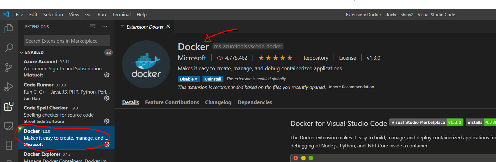
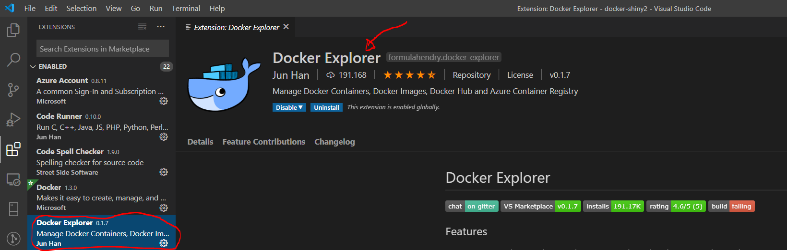
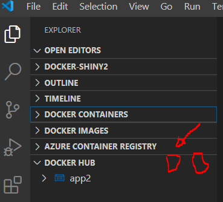

Alojar aplicaciones de Shiny en tu página web depende principalmente del tipo de hosting que tengas contratado. La opción gratis y fácil es utilizar [el servidor de shiny](https://www.shinyapps.io/) desde RStudio y con un solo click es posible subirlas. Pero la versión gratuita tiene una limitación y es que solo permite utilizar la app 25 horas al mes, y ese tiempo se pasa en un santiamén. Buscando alguna solución he navegado bastantes horas por internet y he encontrado partes de respuestas en todos lados. Mi intención con esta entrada es poner en orden toda esa información y de paso dejar constancia de como lo he hecho para que no se me olvide en el futuro. 

El objetivo es meter la aplicación de shiny en un contenedor [docker](https://es.wikipedia.org/wiki/Docker_(software)), en el servidor remoto instalar docker y desde el servidor levantar la aplicación. Todo esto desde windows 10 utilizando [RStudio](https://rstudio.com/), [Vscode](https://code.visualstudio.com/) y [Putty](https://www.putty.org/), este último para gestionar las claves ssh. 

Doy por sentado que ya está instalado R, RStudio y Vscode en Windows 10.

La estructura de la carpeta es la siguiente:

```
+-- dockerfile
\-- shinyapps
    +-- app.R
    +-- datos.csv
```

## Paso 0
Hacer una aplicación de shiny. En esta entrada no lo explico pero se puede seguir el siguiente tutorial: [enlace](https://shiny.rstudio.com/tutorial/).

Si no tienes una aplicación lista en este momento puedes descargar mi script de la <a href="app.R" download>app.R</a> y los <a href="datos.csv" download>datos.csv</a>.

## Paso 1. Instalar Docker

Antes de instalar Docker Desktop en Windows 10 la primera vez, se tiene que permitir la virtualización desde la BIOS e instalar el núcleo de Linux. Yo seguí los pasos de este [enlace](https://docs.docker.com/docker-for-windows/install-windows-home/), después instalé Docker Desktop desde este otro [enlace](https://hub.docker.com/editions/community/docker-ce-desktop-windows). Esto me llevó un buen rato porque nunca me meto en la Bios de mi computadora. 

Podemos comprobar si nuestra instalación tuvo éxito poniendo lo siguiente en la terminal de windows:

```
docker --version

```


## Paso 2. Instalar plugin de docker en Vscode

Ahora que está funcionando docker, instala el plugin de docker en vscode. 



Y a mayores, aunque no es necesario, puedes instalar este otro plugin que resulta muy útil:



Podemos también probar que está funcionando docker desde la terminal de Vscode: `ctrl + shift + P --> View:Toggle Integrated Terminal --> docker --version`. 

#### Paso 2.1 (opcional)
Crear una cuenta en [docker hub](https://hub.docker.com/). Esto nos va ayudar a traer la imagen desde el repositorio de dockerhub al servidor. El repositorio es público así que si no queremos utilizar esta opción podemos guardar el contenedor en un .tar y compartir simplemente el archivo (lo explico después).

## Paso 3. Crear la imagen de la aplicación

### Dockerfile

El dockerfile es un script que le da las instrucciones a docker para crear la imagen de la app. Usuarios más avanzados utilizan un archivo `docker-compose.yml` para darle instrucciones al orquestador `docker compose` u otro tipo de archivos para distintos [orquestadores](https://www.campusmvp.es/recursos/post/las-10-herramientas-mas-importantes-para-orquestacion-de-contenedores-docker.aspx). Además también sería posible utilizar otros archivos del tipo `makefile`, `shiny-server.conf` o `shiny-server.sh` etc., para hacer módulos de instrucciones. Pero por el momento vamos a la opción sencilla. 

El dockerfile que yo utilicé es el siguiente:

```
# Instalar servidor de shiny con rocker
FROM rocker/shiny-verse:3.5.0

RUN apt-get update && apt-get install libcurl4-openssl-dev libv8-3.14-dev -y &&\
  mkdir -p /var/lib/shiny-server/bookmarks/shiny

# Bajar e instalar las librerías de R
RUN R -e "install.packages(c('shinythemes', 'DT', 'shinydashboard', 'shinyjs', 'V8', 'ggrepel'))"

# Copiar la app a la imagen
COPY shinyapps /srv/shiny-server/

# Copiar configuración del servidor shiny
COPY shiny-server.conf  /etc/shiny-server/shiny-server.conf

# Hacer todas las apps leíbles (solves issue when dev in Windows, but building in Ubuntu)
RUN chmod -R 755 /srv/shiny-server/

# Indicar el puerto disponible para shiny
EXPOSE 3838

# Copiar donde poner los logfiles
COPY shiny-server.sh /usr/bin/shiny-server.sh

# Correr la aplicación
CMD ["/usr/bin/shiny-server.sh"] 

```
Si quieres puedes descargarlo <a href="dockerfile" download>aquí</a>.

```
# Instalar servidor de shiny con rocker
FROM rocker/shiny-verse:3.5.0
```
Todos los dockerfiles empiezan con `FROM`. En este caso lo que le decimos a docker es que utilice la imagen que está en el dockerhub como [rocker/shiny-verse](https://hub.docker.com/r/rocker/shiny-verse) etiquetada como la versión 3.5.0. Utilizo esta versión porque me funcionó bien. Si no utilizo la etiqueta `3.5.0`, por defecto descarga la última versión `latest`. Puedes saber más del proyecto Rocker en este [enlace](https://www.rocker-project.org/). 

```
# Instalar dependencias de Linux
RUN apt-get update && apt-get install libcurl4-openssl-dev libv8-3.14-dev -y &&\
  mkdir -p /var/lib/shiny-server/bookmarks/shiny
```
Instalo las dependencias de Linux utilizando el comando `apt-get` que para los que utilicen Linux es muy familiar.
Aquí tienes una breve descripción de las librerías:  

- [libcurl4-openssl-dev](https://packages.debian.org/jessie/libcurl4-openssl-dev)

- [libv8-3.14-dev](https://packages.debian.org/stretch/libv8-3.14-dev)

Algunos comandos de Linux como `-y` o `-p` y muchos más los aprendí (a marchas forzadas) con el libro [The Linux Command Line](https://books.google.es/books/about/The_Linux_Command_Line.html?id=OCFKdl3wEDIC&redir_esc=y) que convenientemente sabrás encontrar, o algún otro documento similar si buscas un poco. 

```
# Bajar e instalar las librerías de R
RUN R -e "install.packages(c('shinythemes', 'DT', 'shinydashboard', 'shinyjs', 'V8', 'ggrepel'))"
```
Estas son librerías de R de las que depende la app. Instala las que le hagan falta a tu app
. En particular la librería [shinyjs](https://www.google.com/search?q=shinyjs+package&rlz=1C1CHBF_esES872ES872&oq=shinyjs+&aqs=chrome.0.69i59j69i57j0l4j69i60l2.8335j0j4&sourceid=chrome&ie=UTF-8) y [V8](https://cran.r-project.org/web/packages/V8/index.html) son necesarias al estar montando la app sobre Debian/Ubuntu así que mejor por si las dudas deberías incluírlas. 

```
# Hacer todas las apps leíbles
RUN chmod -R 755 /srv/shiny-server/
```
Resuelve los conflictos específicos de construir la imagen desde windows sobre Ubuntu o Debian. Encontré esta línea de código en un foro, después de que fallara la construcción de la imagen varias veces. 

```
# Indicar el puerto disponible para shiny
EXPOSE 80
```
Este es un puerto estándar para el servidor de shiny. En la red encontré varios ejemplos en los que utilizan el puerto 3838 pero por algún motivo a mi no me funcionaba así que buscando la opinión de otros usuarios de docker en [stackoverflow](https://stackoverflow.com/questions/tagged/docker+shiny) pude encontrar esta alternativa. Es también muy útil el documento guía de configuración del servidor de [Shiny](https://docs.rstudio.com/shiny-server/).  

```
# Copiar donde poner los logfiles
COPY shiny-server.sh /usr/bin/shiny-server.sh
```
Si la aplicación falla en el servidor entonces podemos depurar más fácilmente. 

```
# Correr la aplicación
CMD ["/usr/bin/shiny-server.sh"] 
```
Por último se incluye esta orden para indicarle a Docker que corra la aplicación. 

#### Generar la imagen

Desde la terminal de Vscode ejecutamos la siguiente orden:

```
docker build -t miapp:etiqueta .
```
El espacio y el punto después de `miapp:etiqueta .` no es una errata (yo creía que sí la primera vez que lo ví). 
Este proceso tarda un poco dependiendo de tu computadora. 

#### Crear contenedor y correr la app

Ahora que ya tenemos la imagen tenemos que ponerla en un contenedor, ejecutamos lo siguiente desde la consola de Vscode:

```
docker run --name=contenedor -p 80:3838 miapp:etiqueta
```
Si todo salio bien, poniendo `http://localhost/` en tu navegador deberías poder ver la aplicación. 

Para parar el contenedor utiliza `docker stop contenedor` y como ya te podrás imaginar para activarlo utiliza `docker start contenedor`. 

Docker tiene muchos comandos como puedes ver en este [enlace](https://docs.docker.com/engine/reference/commandline/docker/), por ese motivo se considera una buena práctica hacer más documentos -modulos- para poder reutilizar código.

## Paso 4. Subir la imagen a Dockerhub o guardarla .tar

**Dockerhub**

Para mi la opción que funcionó mejor fue subir mi aplicación a dockerhub. Si instalaste el plugin de docker en Vscode tienes que logearte primero a tu cuenta de dockerhub:



Una vez logeado creamos una imagen nueva que contenga el usuario de dockerhub

```
docker tag miapp:etiqueta usuariodocker/nombreapp:etiqueta
```
Y esta nueva imagen es la que subimos con el comando:

```
docker push usuariodocker/nombreapp:etiqueta
```
Es evidente que en vez de `usuariodocker` tienes que utilizar tu usuario de dockerhub p.e. `fulanito/miapp:1.0`. 

Posteriormente puedes borrar esta imagen hecha *ex profeso* para subir con:

```
docker rmi -f iddelaimagen
```
Para encontrar el id de tu imagen puedes ejecutar `docker images ls` y copiar el id. 

**.tar**

La segunda opción es almacenar la imagen en un archivo .tar

```
docker save -o C:/Users/.../miapp.tar miapp
```
y compartir la imagen con otras personas o bien subirla directamente al servidor. 


## Paso 5. Instalar docker en el servidor

Si la aplicación está corriendo con normalidad en tu ordenador, entonces también debería de correr de la misma manera en un servidor porque todo lo que necesita para ejecutarse está dentro del contenedor. Este es precisamente el [motivo por cual se utiliza docker](https://www.campusmvp.es/recursos/post/los-beneficios-de-utilizar-docker-y-contenedores-a-la-hora-de-programar.aspx). 

En este paso hay dos alternativas: En mi caso particular tengo mi página en un servidor VPS sencillo corriendo en un Debian 9 pero también probé la alternativa de [Digital Ocean](https://www.digitalocean.com/) que me pareció muy buena y barata. 

**Servidor Linux**

Desde el ssh del servidor hay que seguir los pasos de este [enlace](https://docs.docker.com/engine/install/debian/). No debería haber muchos problemas para instalarlo. Una vez realizada la instalación podemos comprobar que el motor de docker está funcionando poniendo el comando `docker --version` o bien `sudo docker run hello-world`. Este último descarga un contenedor que imprime la frase "hello world". 

**Digital Ocean**

Esta es una de las alternativas que está circulando mucho por la red y realmente es barata y para aplicaciones no muy pesadas va perfectamente. Por 5 euros al mes se puede contratar un "droplet" y alojar nuestro contenedor ahí. Las instrucciones para preparar el entorno las encontré en este [enlace](https://www.youtube.com/watch?v=JFNMHV5J9qM).

## Paso 6. Correr imagen de la app en el servidor

Este es el punto dónde es conveniente instalar [PuTTY](https://www.putty.org/) para poder levantar los contenedores desde local. Las instrucciones para descargar y comunicarse las encontré en este [enlace](https://www.digitalocean.com/docs/droplets/how-to/connect-with-ssh/putty/) de Digital Ocean, pero bien valen para cualquier otro servidor. 

Una vez que hemos descargado y configurado PuTTY siguiendo las instrucciones del anterior enlace tenemos que alojar la imagen de la app en el servidor. Aquí tenemos dos opciones: i) Jalar la imagen desde dockerhub que subimos previamente ó ii) subir manualmente el archivo .tar.

**Desde Dockerhub**

Desde la consola de PuTTy y lógicamente conectados al servidor jalamos la imagen desde dockerhub con el comando.

```
docker pull fulanito/miapp:1.0

```

Una vez que ya está la imagen podemos correrla con 

```
docker run --name=contenedor -p 80:3838 miapp:etiqueta
```
Una vez está activo el contenedor podemos ya acceder a la IP correspondiente a tu servidor o al de digital ocean y compartirlo. 

**Desde .tar**

Podemos incluso copiar y pegar o arrastrar el .tar a nuestro servidor y utilizaremos el siguiente comando para leer: 

```
docker load miapp.tar 
```

```
docker run --name=contenedor -p 80:3838 miapp:etiqueta
```

## TO-DO

- Comunicación con un SLQ y con otros contenedores 
- Nginex y proxy Shiny